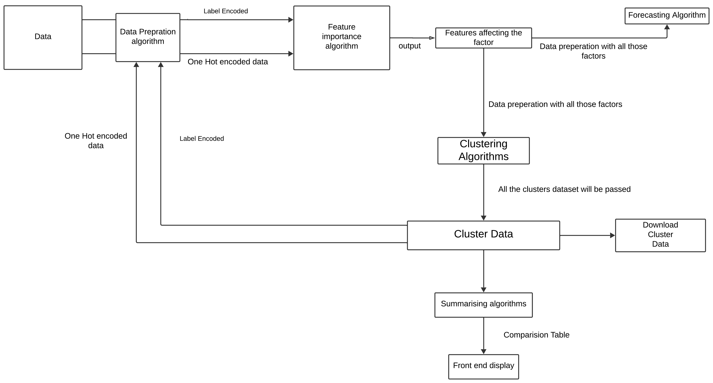

# instant-ai

Read the Contributing information carefully before committing

## Table of Contents

- [Contributing](#Contributing)
- [Installation](#installation)
- [Usage](#usage)
- [Architecture Diagram](#architecture-diagram)
- [License](#license)


## Contributing

Follow the following instructions for Contributing to the repository.

1. **Fork** the repository.

2. **Create a new branch**:  
   ```bash
   git checkout -b [your-branch-name]
   ```
   ***To delete this local branch, use:***:
   ```bash
   git branch -d [your-branch-name]
   ```
   ***If the branch hasn’t been merged and you still want to delete it, you can force delete it with***:
   ```bash
   git branch -D [your-branch-name]
   ```
   ***To switch back to the main branch, use the following command:***
   ```bash
   git checkout main
   ```

3. **Commit your changes**:  
    follow the commit message format
    ```bash
    git commit -m 'commit-00006: commit message'
    ```

    ***To check the last commit message***
    ```bash
    git log -1
    ```
4. **Push to the branch**:  
   ```bash
   git push origin [your-branch-name]
   ```

## Installation

Follow these steps to set up the project:

```bash
git clone https://github.com/neonsodium/instant-ai.git

cd instant-ai

python3 -m venv venv

source venv/bin/activate

pip3 install -r requirements.txt
```

## Usage

To run the flask server, execute the following command:

```bash
python3 run.py
```
To run the celery worker, ececute the following command:

```bash
celery -A celery_worker.celery worker --loglevel=info
```

## Architecture Diagram



## License

This is proprietary code belonging to PESU Venture Labs. All rights reserved. Unauthorized use, distribution, or modification of this code is strictly prohibited.
